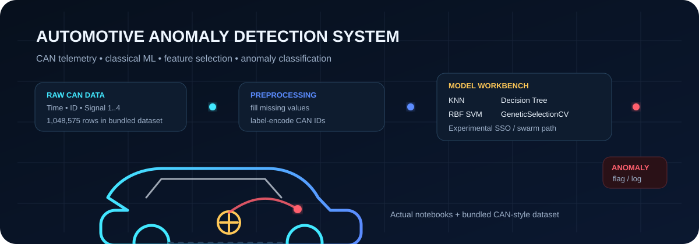
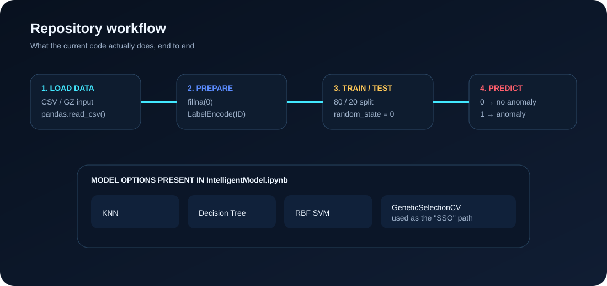
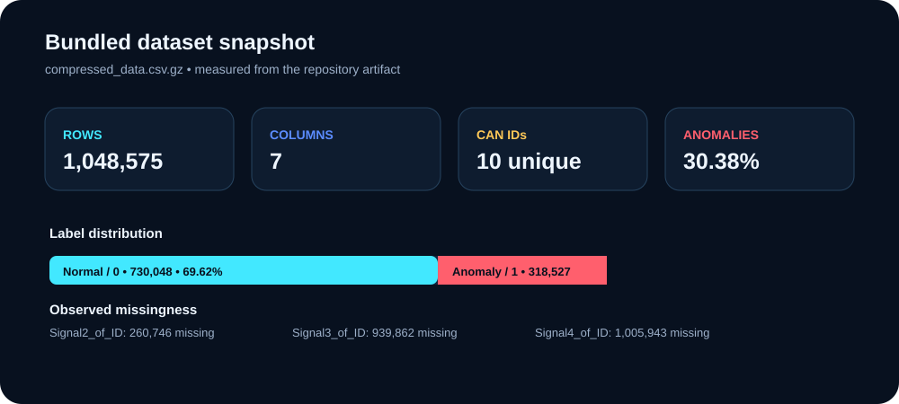
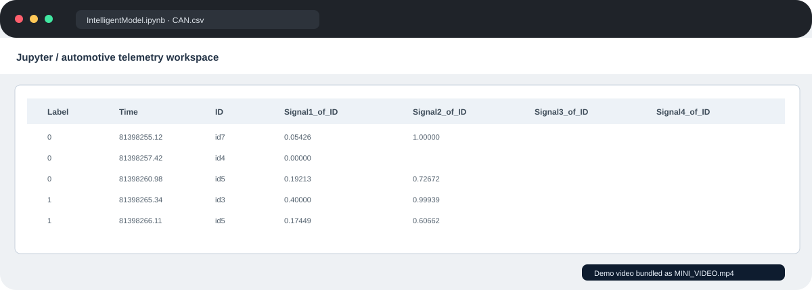

# Automotive Anomaly Detection System

> **🔬 ML EXPERIMENT LAB**
>
> Notebook-driven anomaly classification for automotive CAN-style telemetry.
>
> This documentation is deliberately styled as an **experiment log**, not a product landing page. It focuses on the dataset, model bench, notebook workflow, and limits of the current research prototype.

<table>
<tr>
<td><strong>ENTRY POINT</strong><br/><code>IntelligentModel.ipynb</code></td>
<td><strong>MODEL BENCH</strong><br/>KNN · Tree · RBF SVM</td>
<td><strong>DATA</strong><br/>1,048,575 rows</td>
<td><strong>STATUS</strong><br/>Research prototype</td>
</tr>
</table>



---

## 01 · Experiment notebook

The primary notebook, `IntelligentModel.ipynb`, loads a CSV-style automotive telemetry dataset, fills missing values, label-encodes the CAN message `ID`, splits a training subset into train/test partitions, and exposes several classifiers through a Tkinter GUI.

The current workflow supports:

- **K-Nearest Neighbors (KNN)** for baseline anomaly classification.
- **Decision Tree** classification with a two-feature limit.
- **RBF-kernel Support Vector Machine (SVM)** with `C=2.0`.
- **GeneticSelectionCV + SVM** as the experimental feature-selection path exposed by the GUI's **"SSO with SVM"** button.
- A plotting view for comparing the classifiers' hit/correct-rejection/miss/false-alarm values.
- Batch prediction on a selected test CSV, where `0` is displayed as **No Anomaly Detected** and `1` as **Anomaly Detected**.

The secondary `test.ipynb` is an experimentation notebook. It imports `SwarmPackagePy` and exercises a swarm/spider-style path, while also containing commented-out classifier experiments.

## ◈ Pipeline



### The data path

```text
compressed_data.csv.gz / test.txt
            │
            ▼
       pandas.read_csv
            │
            ▼
     missing-value fill
            │
            ▼
       LabelEncoder(ID)
            │
            ▼
       train_test_split
            │
     ┌──────┼─────────┬───────────────┐
     ▼      ▼         ▼               ▼
    KNN   Tree       RBF SVM   GeneticSelectionCV
     │      │         │               │
     └──────┴─────────┴───────────────┘
                    │
                    ▼
             anomaly prediction
```

### Important implementation detail

The code uses **`GeneticSelectionCV`** in the function named `SSO()`. It is not a clean, standalone Social Spider Optimization implementation. The experimental notebook also imports `SwarmPackagePy`, but that code is not connected to the GUI's final prediction path. This distinction matters before quoting the project as a production-grade SSO benchmark.

## 📊 Bundled dataset



`compressed_data.csv.gz` contains **1,048,575 rows** and **7 columns**:

| Column | Meaning in the repository | Notes |
|---|---|---|
| `Label` | Target class | `0` = normal, `1` = anomaly |
| `Time` | Event timestamp/value | Floating-point numeric field |
| `ID` | Message identifier | 10 unique IDs (`id1` … `id10`) |
| `Signal1_of_ID` | Signal value | Numeric |
| `Signal2_of_ID` | Signal value | Contains missing values |
| `Signal3_of_ID` | Signal value | Heavily sparse |
| `Signal4_of_ID` | Signal value | Very heavily sparse |

Observed class balance in the bundled file:

- **730,048 normal samples** (`69.62%`)
- **318,527 anomaly samples** (`30.38%`)

The training routines in `IntelligentModel.ipynb` intentionally read only the **first 14,000 rows** of the selected training CSV (`nrows=14000`). Missing values are then replaced with `0`.

## 🧠 Model workbench

| Model | Current implementation | Role |
|---|---|---|
| KNN | `KNeighborsClassifier()` | Baseline classifier |
| Decision Tree | `DecisionTreeClassifier(max_features=2)` | Lightweight tree baseline |
| SVM | `svm.SVC(C=2.0, gamma='scale', kernel='rbf')` | Main classical ML baseline |
| Genetic selection | `GeneticSelectionCV(SVC(...))` | Experimental feature-selection path |
| Swarm experiment | `SwarmPackagePy.ssa(...)` in `test.ipynb` | Separate research experiment |

### About the metrics

The GUI labels the returned values as **Hit Rate (HR)**, **Correct Rejection Rate (CR)**, **Miss Rate (MR)**, and **False Alarm Rate (FR)**. The current notebook derives some of those values from `accuracy_score`, `precision_score`, and a confusion matrix.

**Do not treat the old README's `95% accuracy`, `<2% false-positive rate`, or `<10 ms` latency figures as verified benchmarks.** Those figures are not supported by the current repository artifacts, and the experimental `SSO()` metric block contains mistakes that should be corrected before publishing benchmark claims.

## 🖥️ Demo / GUI

`IntelligentModel.ipynb` builds a Tkinter interface with buttons for dataset loading, each classifier, graphing, and test-file prediction.

<a href="MINI_VIDEO.mp4">
  
</a>

**Open the preview above to jump to the bundled `MINI_VIDEO.mp4` demo.**

## 🚀 Quick start

This repository currently does **not** contain a `requirements.txt` or `main.py`; the practical entry point is the Jupyter notebook.

### 1. Clone

```bash
git clone https://github.com/Sai-Srinivas-P/AUTOMOTIVE-ANOMALY-DETECTION-SYSTEM.git
cd AUTOMOTIVE-ANOMALY-DETECTION-SYSTEM
```

### 2. Create a virtual environment

```bash
python -m venv .venv
```

Activate it with your platform's normal command, then install the notebook dependencies:

```bash
python -m pip install --upgrade pip
python -m pip install numpy pandas matplotlib scikit-learn genetic-selection SwarmPackagePy jupyter
```

> On Linux distributions where Tkinter is packaged separately, install the OS package that provides `python3-tk` before launching the GUI.

### 3. Launch the primary notebook

```bash
jupyter notebook IntelligentModel.ipynb
```

Then use **Upload CAN Bus Dataset** to select `compressed_data.csv.gz` or another compatible CSV file.

### 4. Try the included test data

`test.txt` is a small inference-style sample containing `Time`, `ID`, and four signal columns. The notebook's prediction workflow expects a compatible CSV layout and label-encodes `ID` before prediction.

### 5. Explore the swarm experiment

```bash
jupyter notebook test.ipynb
```

This notebook is exploratory rather than a polished application entry point.

## 📁 Repository map

```text
AUTOMOTIVE-ANOMALY-DETECTION-SYSTEM/
├── IntelligentModel.ipynb      # Main Tkinter + ML workbench
├── test.ipynb                  # Swarm / classifier experiments
├── compressed_data.csv.gz      # Bundled labeled dataset
├── test.txt                    # Small test/inference sample
├── MINI_VIDEO.mp4              # Demo recording
├── assets/
│   ├── aads-hero.svg
│   ├── can-anomaly-pulse.svg
│   ├── dataset-overview.svg
│   ├── detection-pipeline.svg
│   └── demo-preview.svg
├── LICENSE
└── README.md
```

## 🔎 Data preparation used by the notebooks

The main notebook follows a compact preprocessing path:

1. Read the selected CSV with pandas.
2. Keep the first 14,000 rows for classifier training.
3. Replace missing numeric values with `0`.
4. Encode `ID` with `LabelEncoder`.
5. Select the model-specific feature slice.
6. Split into train/test sets with `test_size=0.2` and `random_state=0`.
7. Fit the selected classifier and predict the held-out rows.

That is useful for experimentation, but it is **not yet a production CAN intrusion-detection stack**: there is no live CAN socket integration, streaming ingestion layer, model persistence, service/API boundary, test suite, packaging metadata, or deployment configuration in the repository today.

## ⚠️ Current limitations

A README should tell the truth before it tells a story. The current implementation has several research-prototype constraints:

- The GUI is embedded inside a notebook and uses Tkinter, which makes automated deployment awkward.
- There is no dependency lockfile or `requirements.txt`.
- The training code uses only the first 14,000 rows, even though the bundled dataset is much larger.
- The function named `SSO()` uses `GeneticSelectionCV`, and its current metric calculations are not suitable for reporting final benchmark scores.
- The `SSO()` function also contains a typo in the confusion-matrix call (`rave` instead of `ravel`).
- Missing values are replaced with `0` without a learned imputation strategy.
- There is no model serialization or reproducible inference service.
- The repository contains research/demo artifacts rather than a hardened ECU/edge deployment.

## 🛣️ Sensible next steps

A cleaner evolution path would be:

**notebook prototype → reproducible training script → saved model → real-time CAN ingestion → calibrated anomaly scoring → automated tests → deployable edge service**

The highest-value refactor is to move the model logic out of Tkinter/Jupyter and into importable Python modules with explicit data contracts and unit tests. That would make the anomaly detector measurable, reproducible, and much easier to deploy.

## 🤝 Contributing

Pull requests are welcome for improvements to the model pipeline, preprocessing, reproducibility, documentation, testing, and deployment structure.

A useful contribution should ideally include:

- a focused change;
- a reproducible test or notebook result;
- updated documentation when behavior changes;
- no unverified performance claims.

## 📜 License

This repository is released under the **MIT License**. See [`LICENSE`](LICENSE).

## 👤 Author

**Sai-Srinivas-P**  
GitHub: <https://github.com/Sai-Srinivas-P>

---

<p align="center">
  <sub>Designed around the code, notebooks, dataset, and demo artifacts currently present in this repository.</sub>
</p>
